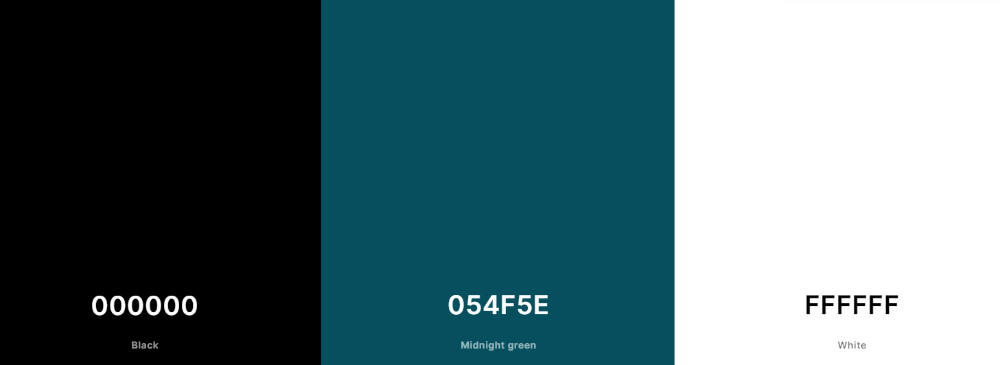
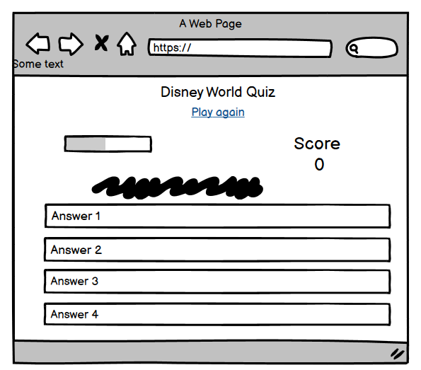
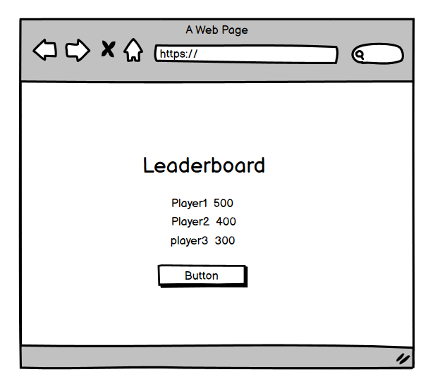
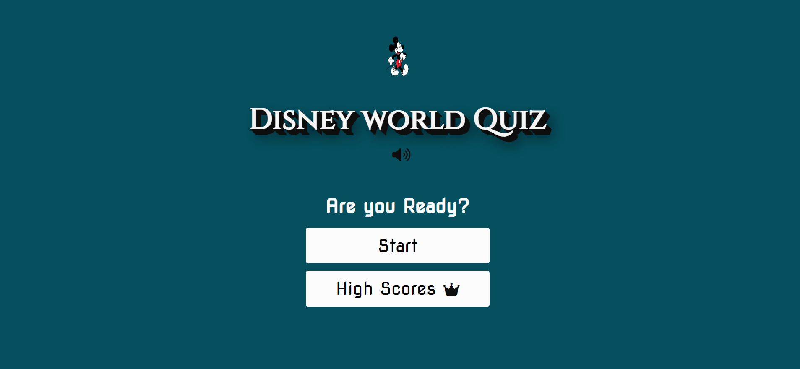
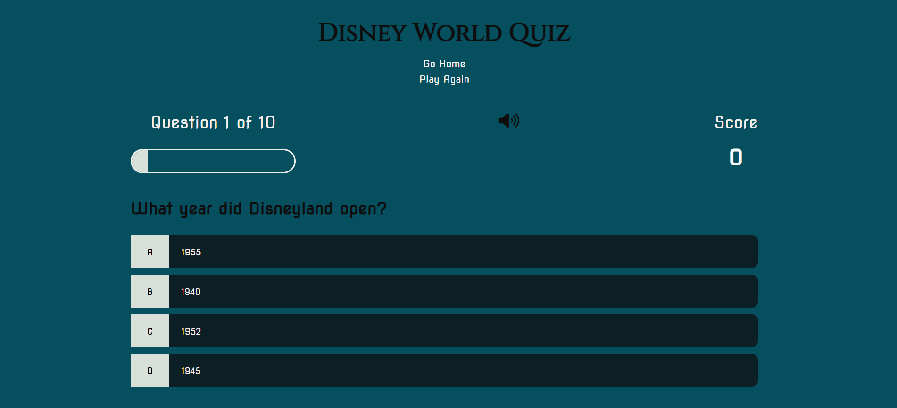
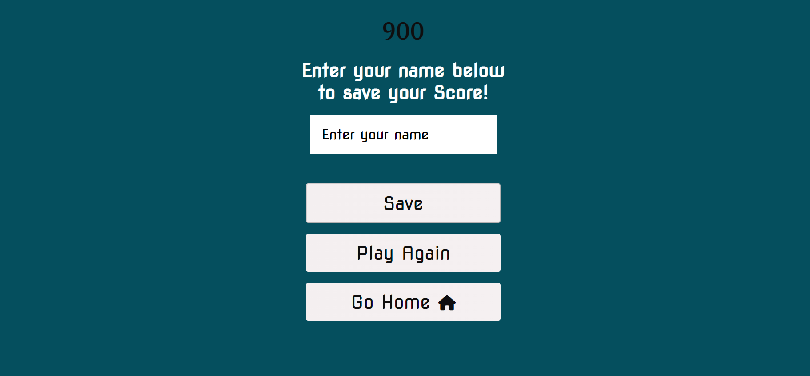

# Disney World Quiz Game
### Developer: Dhvani Intwala

 This is Disney world Quiz Game created as Portfolio Project #2 (JavaScript Essentials) for Diploma in Full Stack Software Development at Code Institute. It is an interactive front-end quiz app where user can test their knowledge about Disney world cartoons. The application is easy to use for the user, is responsive across a range of devices, and incorporates best practices regarding design and accessibility. 
 The game consists of 10 questions. If a player answers a question correctly, they will receive 100 bonus points. Upon completing the game, the user can save their high score and later look back on the top high scores for the game. 

# Table of content
----
## [Project](#project-1)
- [Purpose](#purpose)
- [User Goal](#user-goal)
## [User experience (UX/UI)](#user-experience-uxui-1)
- [Colour Palatte](#colour-palatte)
- [Typography](#typography)
- [Wireframe](#wireframe)
## [Features](#features-1)
- [Start page](#start-page)
- [Game page](#game-page)
- [End page](#end-page)
- [HighScore page](#highScore-page)
- [Future features to implement](#future-features-to-implement)
## [Technology Used](#technology-used-1)
- [Languages Used](#languages-used)
- [Softwares Used](#softwares-used)
## [Testing](#testing-1)
- [Function Testing](#function-testing)
- [Performance](#performance)
- [Validation](#validation)
    - [HTML](#html)
    - [CSS](#css)
    - [JAVA SCRIPT](#java-script)
- [Browser compatibility](#browser-compatibility)
- [Responsiveness](#responsiveness)
- [Peer Review](#peerreview)
    - [Bugs Found and Solved](#bugsfoundandsolved)
## [Deployment](#deployment-1)
## [Credits](#credits-1)
## [Content](#content-1)
## [Acknowledgment](#acknowledgment-1)

----
## project 
### **Purpose**
The aim of this project is to deliver an interactive, engaging quiz that is visually and functionally satisfying for the user to play.
This ten-question quiz game was designed for fans of Disney world to test their knowledge and make a competition quiz game with other user friends/family by comparing their High scores.
To achieve the strategic goals I implemented the following features:-
- simple website layout with the content located in the center of the viewport
- easy to click buttons both on computers and mobile touch interfaces
- eye-pleasing graphics to make the experience entertaining.

### **User Goal**
- as a user i want to:
    - navigate easily through the page,
    - see a clean interface and be able to track progress/score,
    - know how many questions I have left to answer,
    - enjoy the game,
    - see my score after I answer the last question,
    - be able to re-play the game and compare my score
    - As a user, I want a responsive site so I can play the game on any device.

## User experience (UX/UI)
### **Colour Palatte**
- The palette was created using the [Coolors](https://coolors.co/) website.
- I have used #033c48cb for background for all pages,       
  #000000 and #fff both to color the text.
- I have used #0bdf24 to display the correct answer.
- I have used #e50e0e to display the wrong answers.

### **Typography**
- Google Fonts was used to import the chosen fonts for use in the website.
    - For the Page title I have used the google font Cinzel.
    - For the body page I have used the google font Nova Square cursive.

### **Wireframe**
- To create the wireframe I used the Balsamiq Wireframing Software.

Start page(Desktop)

 Start page(Moblie)

 Game page(Desktop)

 Game page(Moblie)

 end page(Desktop)

end page(moblie)

 Highscores page(Desktop)

 Highscores page(Desktop)

 

## Features
### **Start page**

- The start page shows the game title along with the logo. 
- Underneath the heading and logo are two buttons that offer the players the choice to either start the game or have a look at the top high scores.

### **game page**

- The game page shows a question and gives the player 4 answer choices to choose from.
- On hover, the answer option bars will expand, creating a more visual representation of what is about to be selected
- When the user plays the game, and if the user gives the wrong answer, the quiz will not show the correct answer, this would make the user more curious, and the user would like to know the Correct answer. Thus making the quiz more interesting, and the user will play the game again to achieve high scores.
- A score count adds hundreds (100) each time the user selects a correct answer. The scoreboard will appear on the top right-hand side during the quiz. 
- Option will turn green if the user selects the correct answer. 
- Option will turn red if the user selects the incorrect answer. 
- On the top left-hand side, progress bar is shown, which will update the user on which questions the user is and how many remaining questions are still left.

### **End page**

### **HighScores page**

### **Future features to implement**

- Having different Difficulty level
- Quit button in between the Quiz
- Countdown timer

## Technology Used
### **Languages Used**

- The Project was written using HTML , CSS and Javascrpit.

### **Softwares Used**

- [Google](https://fonts.google.com/) Fonts for fonts.
- [Coolors](https://coolors.co/) website was used to generate a color theme.
- [Gitpod](https://www.gitpod.io/) was used to write and test the code.
- [Font Awesome](https://fontawesome.com/) was used as a resource for free icons.
- [Balsamiq Wireframe](https://www.balsamiq.com/) – Used to create wireframes for the website
- Microsoft Powertoys - Used to optimise and resize images for screen.
- [Tiny PNG](https://tinypng.com) - Used to further compress optimised images.
- Snipping Tool -  Used to crop Images
- Google Chrome DevTools - Used to debug and test responsiveness of the site
- GitHub - Used to host and deploy the website.
- [Convertio.co](https://convertio.co) - used to convert images to next-gen *webp format
- Free Formatter - used for formatting html and css documents for optimal readability.
- [techsini](https://techsini.com/multi-mockup/)- online tool used to create mockup to present responsive design of this project.
- Lighthouse - Google WebDev tool used for performance/accesibility testing.

## Testing 

Testing was performed across a range of devices, including:

- All website pages have been tested on different browsers: Chrome, Edge, and Safari.
- When a nav element is clicked, it provides the navigation link to the respective page.
- The responsiveness of the website on different screen sizes (Mobile S-320px, Mobile M-375px, Mobile L-425px, Tablet-768px,
Laptop-1024px) using the Devtools service toolbar. The different CSS properties for font, color, background color, links, submit button work as expected.
- Inside the footer, social media is linked when clicked on it,the link directs to the respective social media page.

### **Performance**

- Lighthouse

- Desktop Startpage results:

- Desktop gamepage results:

- Desktop Endpage results:

- Mobile gamepage results:

### **Validation**
### **HTML**

 Index page

 Gmae page

 End page

 Highscore page

### **CSS**

 Stylesheet

### **JAVA SCRIPT**

- All javacript files were validated through jsHint, presenting no errorrs.

### **Browser compatibility**

Website was tested manually on following browsers:
- Google Chrome
- Edge
- Firefox
- Safari

The results were satisfactory on all browsers.

## **Responsiveness**

## Deployment

The Website  develpment was created in the "main" branch.
This  branch was deployed using GitHub pages.

- This site was deployed by completing the following steps:

1. Open GitHub.
2. Click on the project to be deployed.
3. Navigate to the "settings".
4. Navigate down to the "GitHub Pages".
5. Click on "Check it out here".
6. Select the main branch and select "save".
7. The link to the live website was ready on the top.

## Credits

- [W3Schools](https://www.w3schools.com)
- [Stack Overflow](https://www.stackoverflow.co/)  

## Contents

- All the question provided in the game were taken from one online quiz.

- [Disney World Quiz](https://www.w3schools.com)

## Acknowledgements

At first, I would like to thank my mentor Mr. Akshat Garg for helping me during my second project with HTML , CSS and javascript  by providing good guidance and suggesting things which has helped me in eliminating bugs and making a good website. With my commitment and positive approach, not only I completed my second project but had also learned many new cool stuffs in making websites. Moreover, I would also like to thank Slack Team who were always there to keep me motivated throughout my project.

    

