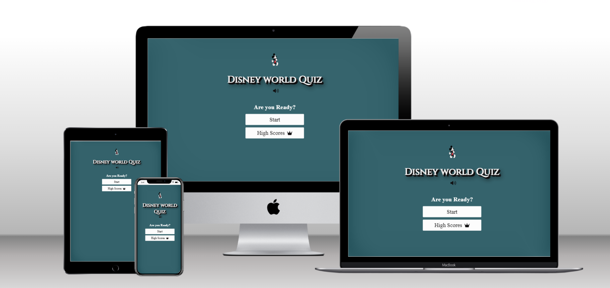

# Disney World Quiz Game
### Developer: Dhvani Intwala

### This is Disney world Quiz Game created as Portfolio Project #2 (JavaScript Essentials) for Diploma in Full Stack Software Development at Code Institute. It is an interactive front-end quiz app where user can test their knowledge about Disney world cartoons. The application is easy to use for the user, is responsive across a range of devices, and incorporates best practices regarding design and accessibility. The game consists of 10 questions. If a player answers a question correctly, they will receive 100 bonus points. Upon completing the game, the user can save their high score and later look back on the top high scores for the game. 

# Table of content
----
## Project
- [Purpose](#purpose-1)
- [User Goal](#userGoal-1)
## User experience (UX/UI)
- [Colour Palatte](#colorpalatte-1)
- [Typography](#typography-1)
- [Wireframe](#wireframe-1)
## Features
- [Start page](#startpage-1)
- [Game page](#gamepage-1)
- [End page](#endpage-1)
- [HighScore](#highScore-1)
- [Future Features to implement](#futurefeaturestoimplement-1)
## Technology Used
- [Languages Used](#languagesused-1)
- [Softwares Used](#softwaresused-1)
## Testing 
- [Accessibility](#accessibility-1)
- [Performance](#performance-1)
- [Validation](#validation-1)
    - [HTML](#html-1)
    - [CSS](#css-1)
    - [JAVA SCRIPT](#javascript-1)
- [Browser compatibility](#browsercompatibility-1)
- [Responsiveness](#responsiveness-1)
- [Peer Review](#peerreview-1)
    - [Bugs Found / Solved](#bugsfound/solved)
## Deployment
## Credits
## Acknowledgment

----

## Project
### **Purpose**

