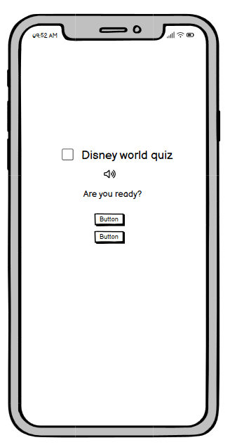
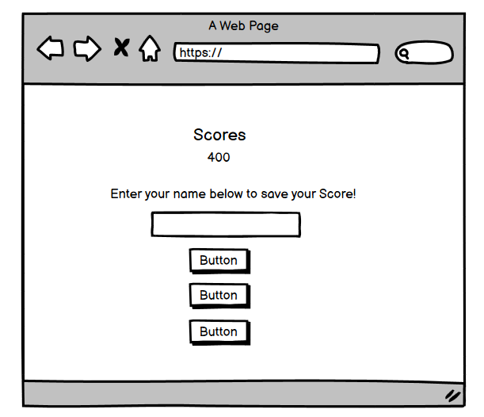
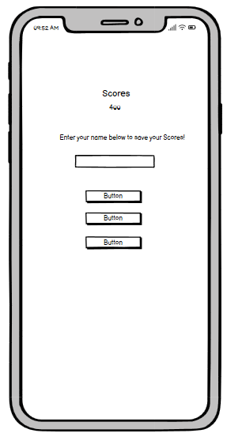
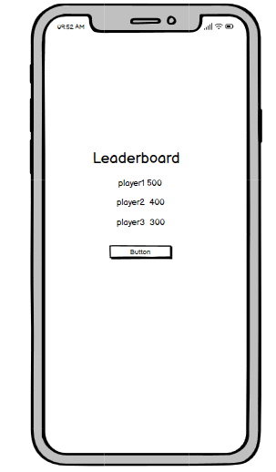

# Disney World Quiz Game
### Developer: Dhvani Intwala

### This is Disney world Quiz Game created as Portfolio Project #2 (JavaScript Essentials) for Diploma in Full Stack Software Development at Code Institute. It is an interactive front-end quiz app where user can test their knowledge about Disney world cartoons. The application is easy to use for the user, is responsive across a range of devices, and incorporates best practices regarding design and accessibility. 
### The game consists of 10 questions. If a player answers a question correctly, they will receive 100 bonus points. Upon completing the game, the user can save their high score and later look back on the top high scores for the game. 

# Table of content
----
## [Project](#project-1)
- [Purpose](#purpose)
- [User Goal](#user-goal)
## [User experience (UX/UI)](#user-experience-uxui-1)
- [Colour Palatte](#colour-palatte)
- [Typography](#typography)
- [Wireframe](#wireframe)
## [Features](#features-1)
- [Start page](#start-page)
- [Game page](#game-page)
- [End page](#end-page)
- [HighScore page](#highScore-page)
- [Future features to implement](#future-features-to-implement)
## Technology Used
- [Languages Used](#languagesused)
- [Softwares Used](#softwaresused)
## Testing 
- [Accessibility](#accessibility)
- [Performance](#performance)
- [Validation](#validation)
    - [HTML](#html)
    - [CSS](#css)
    - [JAVA SCRIPT](#javascript)
- [Browser compatibility](#browsercompatibility)
- [Responsiveness](#responsiveness)
- [Peer Review](#peerreview)
    - [Bugs Found and Solved](#bugsfoundandsolved)
## Deployment
## Credits
## Acknowledgment

----
## project 
### **Purpose**
The aim of this project is to deliver an interactive, engaging quiz that is visually and functionally satisfying for the user to play.
This ten-question quiz game was designed for fans of Disney world to test their knowledge and make a competition quiz game with other user friends/family by comparing their High scores.
To achieve the strategic goals I implemented the following features:-
- simple website layout with the content located in the center of the viewport
- easy to click buttons both on computers and mobile touch interfaces
- eye-pleasing graphics to make the experience entertaining.

### **User Goal**
- as a user i want to:
    - navigate easily through the page,
    - see a clean interface and be able to track progress/score,
    - know how many questions I have left to answer,
    - enjoy the game,
    - see my score after I answer the last question,
    - be able to re-play the game and compare my score
    - As a user, I want a responsive site so I can play the game on any device.

## User experience (UX/UI)
### **Colour Palatte**
- The palette was created using the [Coolors](https://coolors.co/) website.
- I have used #033c48cb for background for all pages,       
  #000000 and #fff both to color the text.
- I have used #0bdf24 to display the correct answer.
- I have used #e50e0e to display the wrong answers.

### **Typography**
- Google Fonts was used to import the chosen fonts for use in the website.
    - For the Page title I have used the google font Cinzel.
    - For the body page I have used the google font Nova Square cursive.

### **Wireframe**
- To create the wireframe I used the Balsamiq Wireframing Software.
- Start page(Desktop)

- Start page(Moblie)

- Game page(Desktop)

- Game page(Moblie)

- end page(Desktop)

- end page(moblie)

- Highscores page(Desktop)

- Highscores page(Desktop)

## Features
### **Start page**

- The start page shows the game title along with the logo. 
- Underneath the heading and logo are two buttons that offer the players the choice to either start the game or have a look at the top high scores.

    

